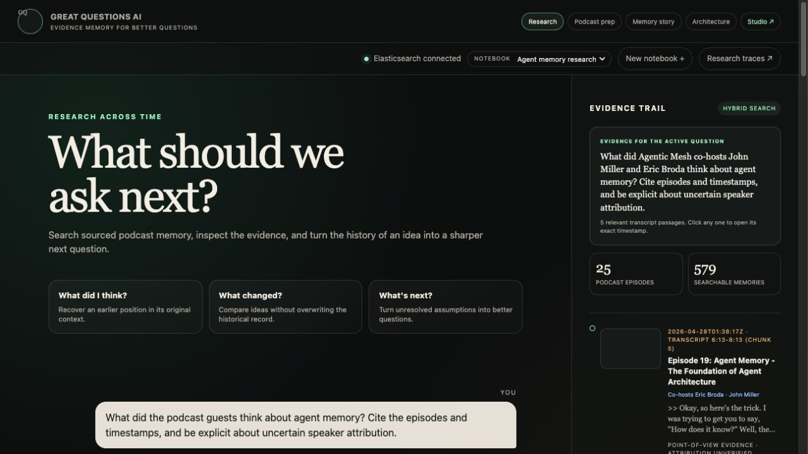
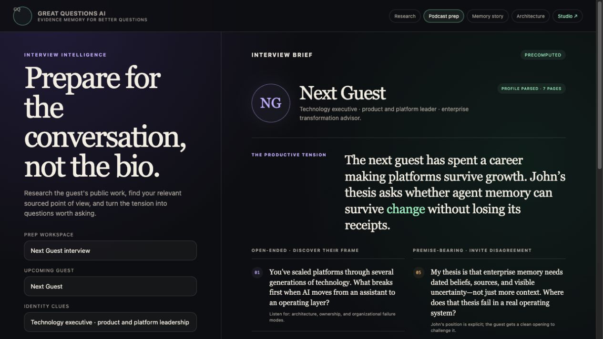
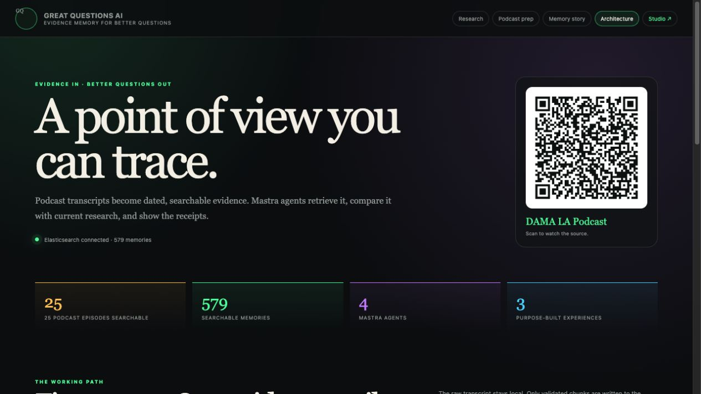

# Great Questions AI

**Evidence memory for better questions.**

Great Questions AI remembers not only what you said, but how your thinking
changed—and uses that sourced history to discover what you should ask next.

[Open the public Memory Story](https://great-questions-ai.onrender.com)
· [View the Devpost submission](https://devpost.com/software/great-questions-ai)
· [Watch the video walkthrough](https://youtu.be/mRkD1FRksxg)


## The idea

Podcast conversations contain valuable ideas, but they are difficult to recover,
compare, or follow through time. Great Questions AI turns timestamped transcripts
into attributable Elasticsearch memories, uses Mastra agents to research them,
and preserves the result as a source-linked story.

The application deliberately separates the **research process** from its
**durable output**:

1. Ask what you previously thought.
2. Retrieve the exact podcast evidence.
3. Compare perspectives and identify supported change.
4. Turn unresolved tensions into better interview questions.
5. Publish the sourced narrative without needing to keep the AI runtime online.

The canonical project concept is preserved verbatim in
[PROJECT-BRIEF.txt](PROJECT-BRIEF.txt).

## Public static edition

The supported public deployment is now a static site. It publishes the durable
Memory Story and an explanation of the completed hackathon process without
running Mastra, Elasticsearch, model providers, uploads, traces, or API routes.

**Live:** [great-questions-ai.onrender.com](https://great-questions-ai.onrender.com)

```bash
npm ci
npm run build:static
```

The build writes three real HTML pages to `dist-static/`:

| Public page | Path |
| --- | --- |
| Memory Story | `/` |
| How it worked | `/how-it-worked/` |
| Architecture | `/architecture/` |

The generated files contain no `fetch`, XHR, WebSocket, `/api/`, or `/agents`
capability. Render's Content Security Policy additionally sets
`connect-src 'none'` and `form-action 'none'`.

The repository includes [render.yaml](render.yaml). In Render, create a new
Blueprint from this repository and use the `main` branch. No environment
variables or secrets are required. Render runs `npm ci && npm run build:static`
and publishes `dist-static` to its global CDN.

## How it works

### 1. Research across time

The Research workshop searches 579 transcript memories across 25 podcast
episodes. Elasticsearch combines lexical and semantic retrieval with RRF. Every
result retains its episode, timestamp, and memory ID.

Each submitted question keeps its own Evidence Trail, so returning to a prior
question restores the passages that grounded that answer.



### 2. Prepare a grounded interview

Podcast Prep combines a guest profile with the host's sourced point of view. It
separates public guest research from private podcast evidence, exposes productive
tensions, and generates open-ended, premise-bearing, and follow-up questions.



### 3. Produce a durable Memory Story

The Memory Story is the output of the hackathon research process: six
evidence-backed shifts in John's thinking about agent memory, ten timestamped
receipts, an Andrej Karpathy comparison, and the questions that come next.

It is precomputed and source-linked. The AI workshop can be turned off while the
story remains available as a publishable artifact.


### 4. Keep the system explainable

The Architecture page shows the path from raw sources to validated memories,
hybrid retrieval, specialist agents, and purpose-built experiences.



## Solution architecture

```text
Podcast transcripts + guest profiles + public research
                         ↓
      provenance, timestamps, deterministic IDs
                         ↓
          Elasticsearch hybrid memory search
                         ↓
          Mastra supervisors and specialists
                         ↓
       Research · Podcast Prep · Memory Story
```

### Evidence layer

- **25 episodes:** six DAMA LA episodes and 19 Agentic Mesh episodes.
- **579 memories:** 159 DAMA LA chunks and 420 Agentic Mesh chunks.
- **Accurate roles:** John Miller is the sole DAMA LA host; Eric Broda and John
  Miller are Agentic Mesh co-hosts. Evidence cards preserve that distinction.
- **Hybrid retrieval:** BM25, `semantic_text`, metadata filters, and RRF.
- **Receipts:** episode URL, exact timestamp, source metadata, and stable memory
  ID remain attached to every retrieved passage.

### Agent layer

- **Great Questions Agent** retrieves historical evidence and separates
  viewpoints.
- **Podcast Prep Agent** combines guest research with the host's sourced thesis.
- **Industry Research Agent** investigates current public sources with citations
  and uncertainty.
- **Agentic Mesh Ingestion Agent** validates a corpus and can write only an
  explicitly approved plan.

Mastra Studio provides local chat, persistent conversation memory, evaluation,
and traces. OpenRouter is the primary model route; Novita GLM-5.3 is available
as a fallback. LibSQL persists local threads, notebooks, and trace data.

## Original research workshop — local only

The original agentic application remains in the repository as the documented
editorial process that produced the static story. It is optional and should not
be deployed as the public site.

Requirements: Node.js 22.13 or newer.

```bash
cp .env.example .env
npm install
npm run typecheck
npm test
npm run dev
```

Add credentials only to the local `.env`; never commit them. The Mastra server
and Studio run at `http://localhost:4111`.

| Experience | Local URL |
| --- | --- |
| Research workshop | `http://localhost:4111/great-questions` |
| Podcast Prep | `http://localhost:4111/podcast-prep` |
| Memory Story | `http://localhost:4111/demo` |
| Architecture | `http://localhost:4111/architecture` |
| Mastra Studio | `http://localhost:4111/agents` |

The custom routes are an unauthenticated local-demo surface. Add authentication
and deployment-specific access controls before exposing the interactive app to
the public internet.

## Elasticsearch setup and ingestion

After adding the Elasticsearch endpoint and API key to `.env`:

```bash
npm run check:elastic
npm run inspect:elastic
```

Review [the Elastic memory model](docs/ELASTIC-MEMORY-MODEL.md), then create
the empty indices when ready:

```bash
npm run setup:elastic
```

After reviewing the exact target alias and Bulk operation, ingest the local DAMA
LA transcripts with:

```bash
npm run ingest:podcast
```

Ask the agent directly from the terminal:

```bash
npm run ask -- "What did these guests say about agent memory?"
```

The Agentic Mesh ingestion agent uses a stricter write gate. It first validates
the ignored local corpus and produces a transcript-free SHA-256 plan. A later
write must provide that exact approved plan hash. Writes use the
`great-questions-memories` alias with `require_alias=true`, `refresh=wait_for`,
bounded batches, a five-minute request timeout, and item-level failure handling.

## API and MCP

With the development server running:

- Mastra REST routes are available under `/api`.
- Swagger UI is available at `/swagger-ui`.
- The registered agents are `greatQuestionsAgent`, `podcastPrepAgent`,
  `industryResearchAgent`, and `agenticMeshIngestionAgent`.
- The local `great-questions` MCP server exposes the agents, Elasticsearch
  connectivity, podcast search, and guarded ingestion tools.
- Optional `ELASTIC_MCP_URL` and a separate least-privilege
  `ELASTIC_MCP_API_KEY` connect Elastic Agent Builder without affecting direct
  Elasticsearch search.

## Repository boundaries

- `.env`, credentials, local databases, build output, and `node_modules` are
  excluded from Git.
- Raw transcript and generated data directories remain excluded from Git.
- README screenshots contain rendered UI only—no credentials or raw files.
- Podcast captions are not diarized reliably, so uncertain speaker attribution
  remains explicit in the product and in the Memory Story.

## Current status

The working prototype includes live hybrid retrieval, timestamped citations,
question-specific saved result sets, persistent Mastra memory and tracing,
model fallback, specialist-agent delegation, interview preparation, a guarded
second-corpus ingestion workflow, and the publishable Memory Story.

Structured claim, idea, question, and prediction document construction is
implemented and tested. Automated claim extraction and evidence-gated temporal
relation adjudication remain deliberate follow-on work.
